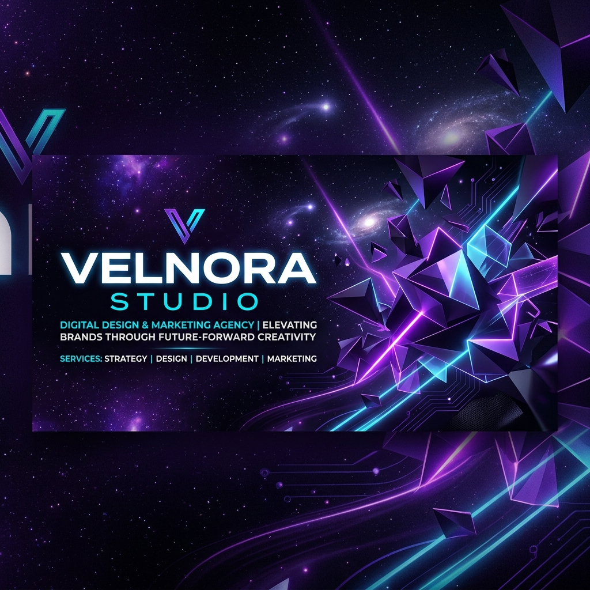

  

  # 🌌 Velnora Studio
  ### We Turn Brands Into Industry Leaders

  
  
  

---

Welcome to **Velnora Studio**, a premium creative digital agency. We combine cutting-edge web development, high-end visual design, and data-driven marketing to help modern brands scale and win.

---

## ⚡ Our Core Services

We partner with high-growth businesses to deliver top-tier results:

| Service | Description | Highlights |
| :--- | :--- | :--- |
| **💻 Web Development** | High-performance websites built with React and Next.js. | Fast load speeds, responsive layouts, SEO-ready code. |
| **🔍 Search Engine Optimization** | Driving organic sales and qualified leads via rank optimizations. | Keyphrase strategy, technical auditing, structural content. |
| **📣 Paid Media & Ads** | High-ROI marketing campaigns on Google, Facebook, and Instagram. | Optimized ad spend, visual design, custom audiences. |
| **🎨 Branding & Assets** | Custom logos, branding systems, and social media kits. | Vector files, typography sets, style guides. |

---

## 🚀 The Velnora Experience (Client Portal)

When you work with us, you don't get lost in emails. You get your own private account in our **Client Portal** where you can:

*   **📅 Track Tasks:** See our current tasks, milestones, and project phases in real-time.
*   **📂 Share Assets:** Upload files, mockups, or documents directly into your secure workspace.
*   **💬 Quick Approvals:** View drafts and approve or request changes with one click.
*   **💳 Manage Invoicing:** Review past bills and track your project payments seamlessly.

---

## 🛠️ Our Tech Ecosystem
We build with the fastest, most reliable tools:
`Next.js 16` • `React 19` • `Tailwind CSS v4` • `Framer Motion` • `Go (Golang)` • `PostgreSQL` • `Docker` • `ArgoCD`

---

## 📬 Start Your Project

Ready to work with us? Let's build something amazing together.

> [!TIP]
> ### 📊 Get a Free Website & Marketing Audit
> We will analyze your current site speed, Google rankings, and ad strategy for free. 
>
> 👉 **[Request Your Free Audit on Our Website](https://www.velnora.studio)** or email us at **[contact@velnora.studio](mailto:contact@velnora.studio)**.
